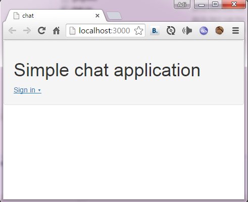
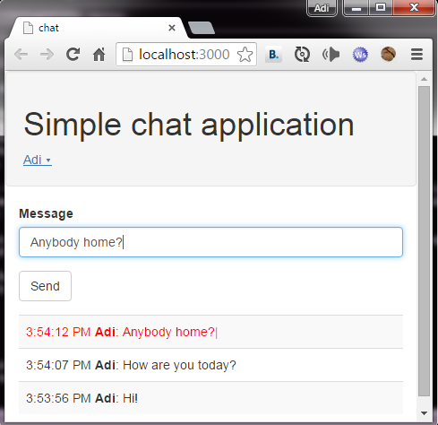

#Simple chat application using Meteor
Adi Levin, 21/Oct/2015

Meteor is an awsome framework for full-stack Javascript app development.
This is a demonstration of a simple chat application with username+password login.

##Packages used

I've used the following Meteor packages:

1. **accounts-ui** for the login buttons
1. **accounts-password** for the user accounts management.
1. **twbs:bootstrap** for the Bootstrap CSS library.

##Get started

1. Install Meteor from [https://install.meteor.com/windows](https://install.meteor.com/windows).
1. Clone the repository.
1. Open a console at the source directory, and run "**meteor**".
1. Open a web browser and navigate to "**localhost:3000**".
1. You should see:

  
1. Use the "**sign in**" button to create an account.
1. When chat works you should see:

  
